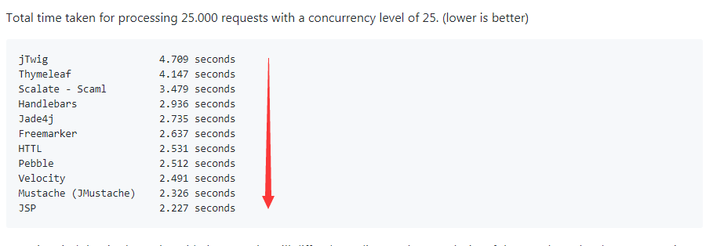

- https://github.com/timebusker/spring-boot / 2019

--------------------------------------------------------------------------------

- spring-boot-core-1-schedule - examples of
- spring-boot-core-2-async - examples of
- spring-boot-core-3-aop - examples of
- spring-boot-core-4-defining-starter - examples of
- spring-boot-data-1-spring-data - examples of
- spring-boot-data-2-ehcache - examples of
- spring-boot-data-3-jdbc-template - examples of
- spring-boot-data-4-mybatis - examples of
- spring-boot-data-4-transcation - examples of
- spring-boot-data-5-redis - examples of
- spring-boot-data-6-mq - examples of
- spring-boot-data-7-mongodb - examples of
- spring-boot-data-9-multi-datasource - examples of
- spring-boot-skeleton-project-example - examples of
- spring-boot-web-1-quickstart - examples of
- spring-boot-web-2-restful - examples of
- spring-boot-web-3-freemarker - examples of
- spring-boot-web-4-swagger2 - examples of
- spring-boot-web-5-monitor-actuator - examples of
- spring-boot-web-6-spring-security - examples of

--------------------------------------------------------------------------------

```shell script
mvn clean spring-boot:run
```

# 关于Spring Boot模板引擎

- 虽然现在很多开发，都采用了前后端完全分离的模式，即后端只提供数据接口，前端通过AJAX请求获取数据，完全不需要用的模板引擎。
这种方式的优点在于前后端完全分离，并且随着近几年前端工程化工具和MVC框架的完善，使得这种模式的维护成本相对来说也更加低一点。
但是这种模式不利于SEO，并且在性能上也会稍微差一点，还有一些场景，使用模板引擎会更方便，比如说邮件模板。
- 总体来讲，Spring boot对thymeleaf和Freemaker支持比较友好，配置相对也简单一点，Spring Boot不建议使用JSP，因为在使用嵌入式servlet容器时，有一些使用限制。
在实际的开发中，大多也以这两种模板引擎为主，很少有用jsp的，jsp现在可能更多是在实验或者学习阶段使用。



[性能对比测试](https://github.com/jreijn/spring-comparing-template-engines)
